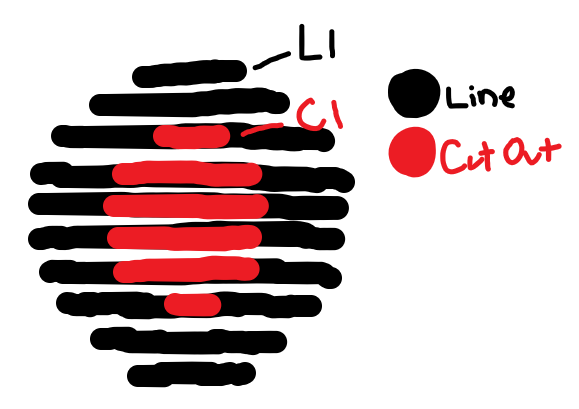
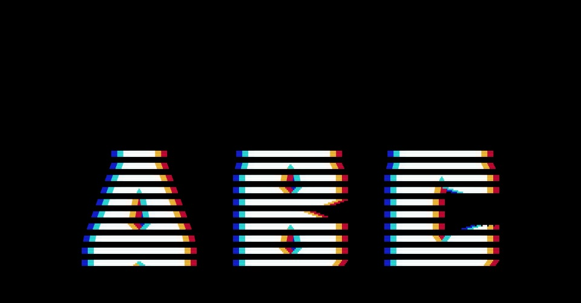
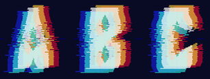
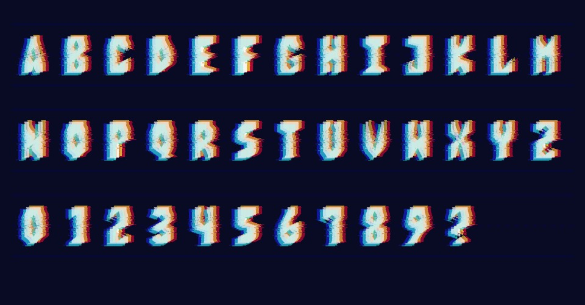
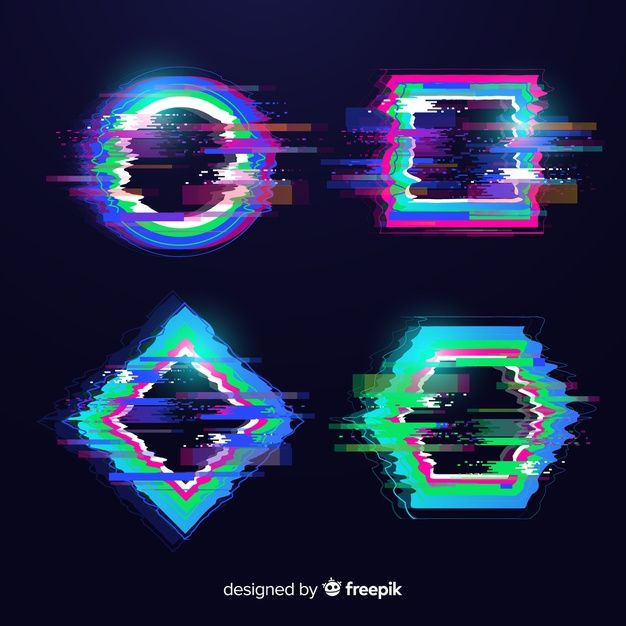
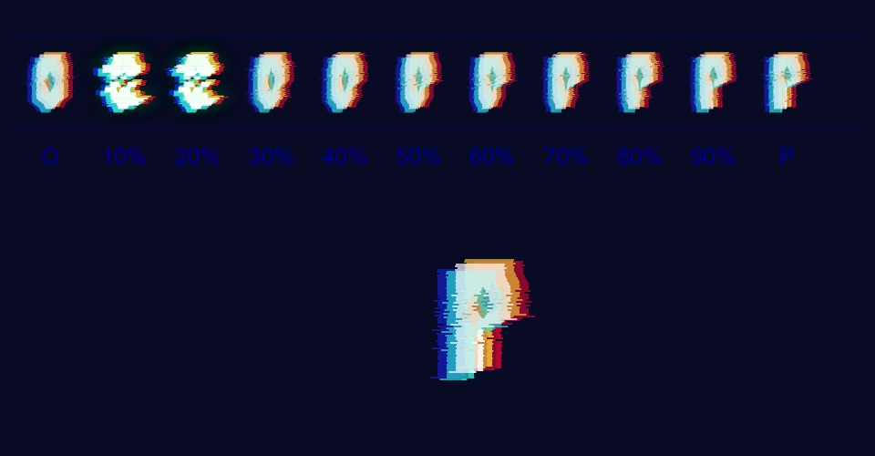
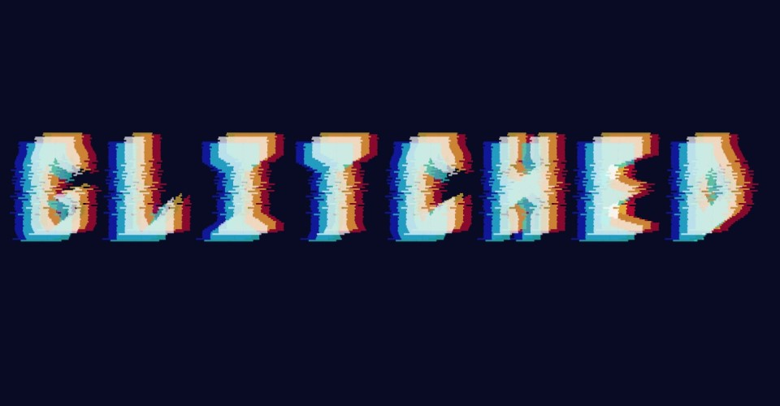

## MDDN 242 2023 Assignment 2

My letters are themed around computer-glitchyness. They are composed of 10 horizonal lines stacked on top of each other. Each of these lines has a width, and also an optional center cut out (for letters like O). I have 20 parameters. The first 10 are the details of each of the 10 horizontal lines, and the last 10 are the details for the cut outs of each of those lines. The parameter values are carefully chosen such that they can double as both width, and the center x point of the line, so that parameters may be re-used. A similar method is used for the cut-out parameters, doubling as both cut-out width and cut-out center x point. To stylize the letters and make them smoother, I draw multiple lines for each line parameter, interpolating between widths to make a smoother form. In case this description is confusing, I have included an image representing how my parameters translate to my letterforms.

The twenty parameters per letter:

  * `l1` : First line (top-most)
  * `l2` : Second line
  * `l3` : Third line
  * `l4` : Fourth line
  * `l5` : Fifth line
  * `l6` : Sixth line
  * `l7` : Seventh line
  * `l8` : Eighth line
  * `l9` : Ninth line
  * `l10` : Tenth line (bottom-most)
  * `c1` : First line cut-out (top-most)
  * `c2` : Second line cut-out
  * `c3` : Third line cut-out
  * `c4` : Fourth line cut-out
  * `c5` : Fifth line cut-out
  * `c6` : Sixth line cut-out
  * `c7` : Seventh line cut-out
  * `c8` : Eighth line cut-out
  * `c9` : Ninth line cut-out
  * `c10` : Tenth line cut-out (bottom-most)

  

## Design Process

### Part 1 (Sketch)
#### Idea
Before beginning work on my letterforms for my sketch, I first looked at resources online for inspiration. Nothing I found really stood out to me, and many of the parameterized works I found looked kind of buggy and unreadable. This was where my idea was born! I decided I would embrace the glitchy-unreadable letterforms and create a font themed around it. There was one issue with this though... if I was going to alter my letters to look glitched, the non-glitched letters would need to be VERY readable in order for them to still be easily readable when they were glitched. With only twenty parameters to play with this would prove quite difficult. The hardest part of this assignment for me was thinking of a good way to represent my letters with parameters.

#### Initial Design
The method I decided on was to represent my letters are 10 horizontal lines, and a contour (cut out) for each line to allow for gaps within a letter. From this idea, I created my initial sketch. (The parameters are the same as the ones listed above)

I added chromatic abberation, which I ended up keeping all the way through to my final design, and put gaps in between the lines to make it look like an old scan-line TV. While choosing values for my 20 parameters, I actually found the limits of the assignment to work in my favour, as using only 10 lines meant I had to get creative with how the letters looked, which actually ended up creating a really cool style in my opinion. I liked the concept of the design, however the biggest thing I would change would be the readability.

### Part 2 (Alphabet)
#### Design Choices
I decided I wanted to develop the glitchy font sketch I made in the previous part further. While I really liked the idea and general aesthetic of it, I thought it could be executed better. I felt the scan-line gaps made the letterforms a bit unecessarily difficult to read, and I wanted to find a good balance of readable and glitchy. The new approach I went for to adding glitchyness to my font was to use noise to stagger each sub-line drawn a bit to the left or right to make it look broken. I also altered the letterforms to look a bit better in general, being taller and thinner, as well as offsetting the chromatic abberation lines a bit on the y axis to make the forms look a little less rigid.

#### Developed Design
My ABC letters after making these changes looked like this, which I was much more happy with and felt it addressed my main issues with my previous design, as well as parameterized fonts in general.

 In my opinion it has a nice unique style, a cool glitchy effect, and most importantly is readable. Because of the way I create my letterforms from parameters, there is also lots of variation I can add to my letters to (hopefully) create the entire alphabet. 

 #### Alphabet Design
 From there, I decided I was happy enough with my parameters and how they translated to letters, and was ready to make my entire alphabet. Honestly the process went very smoothly and I managed to get this done in a few hours. I did go through some revisions afterwards though, as after looking at some letters I felt they didn't look right. For example, before and after of letter 'M'

  

 Getting all the values for the parameters right was a bit difficult, but I think it was made easier by the fact that my parameters represent 10 lines, so I just had to look at a letter on my keyboard and break it into 10 sections. The difficult part was choosing values that blended the lines together in a way that looked nicely stylized and didn't ruin the readability. After some work, I finalized my alphabet.

 

 ### Part 3 (Interpolation)
 #### Initial Interpolation Design
 One of the main reasons I chose to represent letters the way I did, was because I felt it would interpolate smoothly between letters. Since each letter is made up of 10 lines, all that would happen is the individual lines (and contours) would stretch to fit the new letter. After adding the interpolation for my parameters - which was easy as I could iterate over them - I was extremely happy with the smoothness. However, it was a bit... too smooth. The theme of my font is glitches, so the smooth interpolation felt a bit out of place. To address this, when interpolating I added a value to the letter for 'percent' which essentially starts at 0 and goes to 100 to represent how far through interpolation the letter is. I could then use this value to shift the noise offset to make the glitchy offset edges move up and down also. I really liked this effect, and this was my 'final' design for a while before I decided to make some more changes. (You can view this design by watching 'oldInterpolation.mp4')

 #### Final Touches
 After receiving feedback on my design, I was inspired to add MORE glitchyness to the interpolation to fit the aesthetic better. The changes I made were simple but I think they were quite visually effective. The sort of idea I wanted to achieve was something like this:

I decided to do this by shifting different parts of my letters left and right. This was actually really easy because my letters were already separated into 10 lines, so I just had to shift these over. The code was a little bit finicky, I used the modulo operator quite a bit to get alternating offsets and fake some randomness, and even scaled the line segment to make it look even more glitchy. 
The final touch I added was adding a green bloom/glow effect to the letter when it glitches. I experimented with always drawing the glow effect and changing the colour to green when it 'glitched', however this impacted performance too much. :(. Below you can see my final interpolation.

### Part 4 (Exhibition)
After some thought, I decided to name my font 'GLITCHED' as it was an 8 letter word that matched the aesthetic of my letterforms. Overall I am happy with my font. Maybe given some more time I would make some final touches and add some more to it as it's quite simple, but I'm still proud of what I've created! Below you can see the exhibition showing my font in its final form displaying the title of it.

